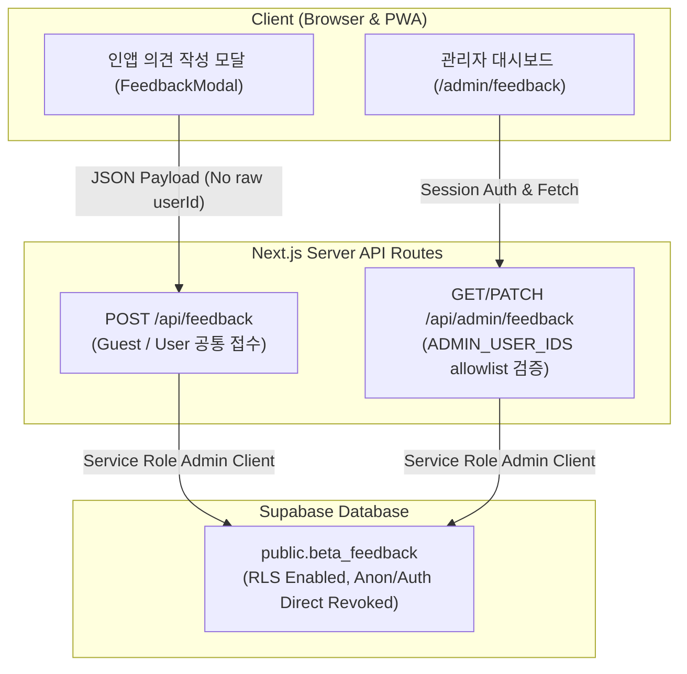

# Day 34 In-App Beta Feedback System & Admin Dashboard Specification

## Executive Summary
Day 34에서는 인앱 "베타 의견 보내기" 모달, 세션 안전 피드백 제출 API (`POST /api/feedback`), `public.beta_feedback` DB migration (`005_beta_feedback.sql`), `ADMIN_USER_IDS` 기반 서버 전용 관리자 인증 헤더(`src/lib/admin/admin-auth.ts`), 관리자 피드백 API (`GET/PATCH /api/admin/feedback`) 및 관리자 대시보드 (`/admin/feedback`) 구축을 완수하였습니다.

---

## 1. 아키텍처 및 보안 설계 원칙

### 핵심 보안 원칙
1. **클라이언트 Direct DB Access 전면 차단 (No Direct Mutations)**:
   - 클라이언트(브라우저)에서 `beta_feedback` 테이블로의 직접 `INSERT`/`UPDATE`/`SELECT`/`DELETE` 권한을 `REVOKE ALL` 처리하여 완전히 차단합니다.
   - 모든 피드백 제출 및 관리자 처리는 **Service Role Admin Client 기반 Server API Route Handler**를 경유합니다.
2. **관리자 인증 allowlist 방식 (`ADMIN_USER_IDS`)**:
   - `src/lib/admin/admin-auth.ts` 내 `isAdminUserId(userId)` 함수로 환경변수 `ADMIN_USER_IDS` (comma-separated UUIDs)를 검증합니다.
   - `NEXT_PUBLIC_ADMIN_USER_IDS` 같은 공개 환경변수를 사용하지 않으며, UUID 하드코딩을 100% 배제합니다.
   - `ADMIN_USER_IDS` 미설정 또는 userId 미존재 시 무조건 `false`를 반환합니다 (Fail-closed).
3. **제출 입력값 무결성 보장**:
   - `POST /api/feedback` 수신 시 클라이언트가 보낸 `severity`, `status`, `admin_note`, `user_id` 속성을 무시하고 서버가 강제로 `severity = "UNCLASSIFIED"`, `status = "NEW"`로 고정합니다.
   - `user_id`는 서버 세션의 `auth.getUser().id` 값만 사용하며 Guest의 경우 `null`로 기록합니다.

---

## 2. DB Schema & RLS Specification (`005_beta_feedback.sql`)

### 2-1. Table Definitions
- **테이블명**: `public.beta_feedback`
- **컬럼 구성**:
  - `id`: `uuid primary key default gen_random_uuid()`
  - `user_id`: `uuid null references auth.users(id) on delete set null`
  - `created_at`: `timestamptz not null default now()`
  - `updated_at`: `timestamptz not null default now()`
  - `page`: `text null` (제출 페이지 경로)
  - `category`: `text not null default 'general'` (`general`, `bug`, `ux`, `feature`)
  - `message`: `text not null` (트림 후 2~2,000자 제한)
  - `device_type`: `text null`
  - `os`: `text null`
  - `browser`: `text null`
  - `app_mode`: `text null` (Standalone PWA / Browser Web)
  - `severity`: `text not null default 'UNCLASSIFIED'` (`UNCLASSIFIED`, `P0`, `P1`, `P2`, `P3`)
  - `status`: `text not null default 'NEW'` (`NEW`, `CONFIRMED`, `IN_PROGRESS`, `FIXED`, `RETEST`, `CLOSED`, `WONT_FIX`)
  - `admin_note`: `text null`
  - `resolved_at`: `timestamptz null`

### 2-2. Account Deletion과의 연계 (`ON DELETE SET NULL`)
- `user_id` FK는 `ON DELETE SET NULL`로 정의되어, 회원이 회원 탈퇴를 수행하더라도 제출되었던 서비스 개선 의견 자체는 익명화 상태로 보존됩니다.

---

## 3. API Route Specification

### 3-1. `POST /api/feedback` (피드백 제출 API)
- **접근 권한**: Public (Guest 및 로그인 회원 공통)
- **입력 검증**:
  - `message`: 최소 2자, 최대 2,000자
  - `category`: `general` | `bug` | `ux` | `feature`
- **서버 고정값**: `severity = "UNCLASSIFIED"`, `status = "NEW"`
- **응답**: `{ "success": true, "id": "..." }`

### 3-2. `GET /api/admin/feedback` (관리자 목록 조회 API)
- **접근 권한**: Admin Only (로그인 필수 + `ADMIN_USER_IDS` allowlist 검증)
- **비인가 응답**:
  - 비로그인: `401 Unauthorized` (`"로그인이 필요합니다."`)
  - 비관리자 계정: `403 Forbidden` (`"관리자 접근 권한이 없습니다."`)
- **응답**: `{ "success": true, "feedback": [...] }`

### 3-3. `PATCH /api/admin/feedback` (관리자 항목 수정 API)
- **접근 권한**: Admin Only
- **수정 허용 필드**: `severity`, `status`, `adminNote`
- **응답**: `{ "success": true, "feedback": updatedRow }`

---

## 4. Vercel 프로덕션 환경변수 설정 가이드

Vercel Production 환경변수에 다음 항목을 등록해야 관리자 대시보드 접근 권한이 활성화됩니다:

- **Key**: `ADMIN_USER_IDS`
- **Value**: `00000000-0000-0000-0000-000000000000,11111111-1111-1111-1111-111111111111` (Comma-separated Supabase User UUIDs)

---

## 5. Production Supabase DB 적용 안내 (중요)

본 Day 34에서 생성된 `supabase/migrations/005_beta_feedback.sql` 파일은 **지침에 따라 아직 프로덕션 Supabase DB에 실행 적용하지 않은 상태**입니다.

사용자의 explicit 승인 후 Supabase Dashboard SQL Editor 또는 CLI migration을 통해 해당 SQL을 실행해 주세요.
